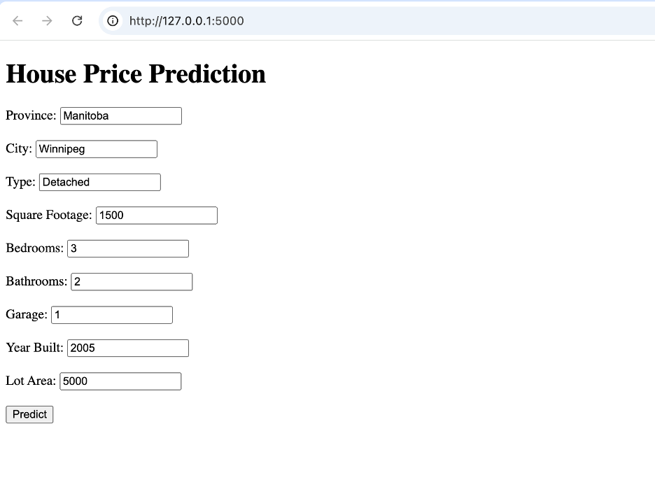
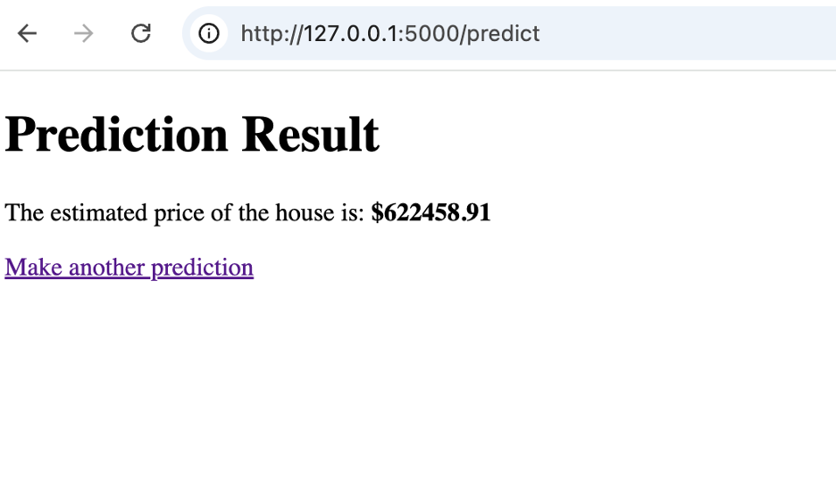

# Canada House Price Prediction Flask App 🏠

This is a Flask-based web application that predicts house prices in Canada based on features such as location, size, and other property details. The app uses a **Random Forest Regressor** machine learning model and provides an interactive interface for predictions.

---

## 🚀 Features
- **Accurate Predictions**: Leveraged a trained machine learning model for reliable results.
- **Interactive Web Interface**: Built with Flask, allowing easy user input.
- **Customizable and Scalable**: Designed for deployment and real-world use.

---

## 📸 Screenshots

### 1. Input Form


> A simple form where users can input property details such as square footage, bedrooms, bathrooms, and more.

### 2. Predicted Price Output


> The app displays the predicted house price with a clean and user-friendly output.

---

## 🛠️ Technologies Used
- **Python**
- **Flask**
- **scikit-learn**
- **Pandas**
- **HTML & CSS**

---

## 🔧 How to Run Locally
1. Clone the repository:
   ```bash
   git clone https://github.com/your-username/house-price-prediction.git
   cd house-price-prediction
